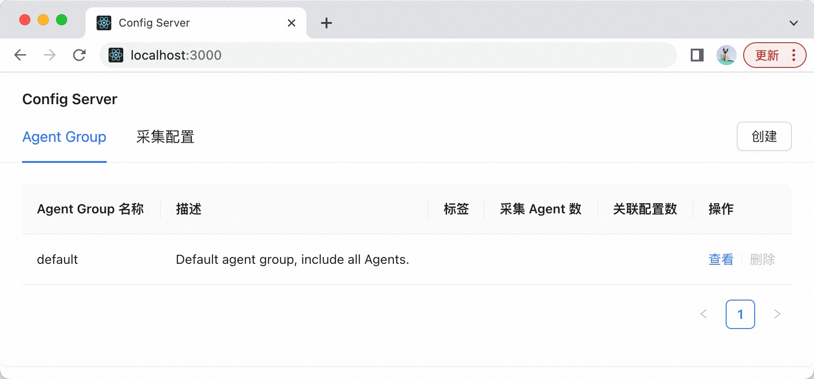

# Alibaba iLogtail Config Server UI

这是基于阿里巴巴 [iLogtail](https://github.com/alibaba/ilogtail) 项目 [Config Server 通信协议](https://ilogtail.gitbook.io/ilogtail-docs/v/pre-release/config-server/communication-protocol)的一个前端实现。使用 [React](https://react.docschina.org) + [Ant Design 组件库](https://ant-design.antgroup.com/index-cn) + [Create React App 脚手架工具](https://create-react-app.bootcss.com)进行开发，旨在为用户提供一个简单、实用、易嵌入的 Config Server 前端控制台。

## 快速开始

```shell
git clone https://github.com/iLogtail/config-server-ui
cd config-server-ui
yarn install
yarn start
```

执行完上述命令，你所在的机器上会启动一个前端服务，默认端口`3000`，通过`chrome`等浏览器访问`http://127.0.0.1:3000`将看到这个简洁的控制台界面。



当然，要使它能够正常工作，你应该按照[此文档](https://ilogtail.gitbook.io/ilogtail-docs/v/pre-release/config-server/quick-start)事先启动`Config Server`。`Config Server`的默认监听端口是`8899`，因此，`yarn start`命令启动的前端服务默认将对接`http://127.0.0.1:8899`。如果想修改，可以指定`CONFIG_SERVER_ADDRESS`环境变量，例如：

```shell
CONFIG_SERVER_ADDRESS=http://192.168.3.17:9988 yarn start
```

## 构建部署

`yarn start`是为开发服务的，部署时为了获取最佳性能，你需要以下命令进行构建：

```shell
yarn build
```

命令执行完成后，把整个`build`文件夹里的静态文件部署到`nginx`服务器。同时，为了能够获取`Config Server`的动态内容，需要使用`nginx`的反向代理功能，转发`/api/v1`的请求到`Config Server`，以下是一个配置示例：

```shell
root /path/to/config-server-ui/build;

location /api/v1/User {
    proxy_pass http://127.0.0.1:8899/User;
}
```

这样，你可以很方便地把构建产物集成和嵌入到自己的运维管理平台。

## 国际化

`config-server-ui`提供最基础的国际化功能，目前支持中文`zh-CN`和英文`en-US`。如果需要切换，需要修改`App.js`的这一行：

```shell
const locale = 'zh-CN';
```

## Licence

[Apache 2.0 License](./LICENSE)
